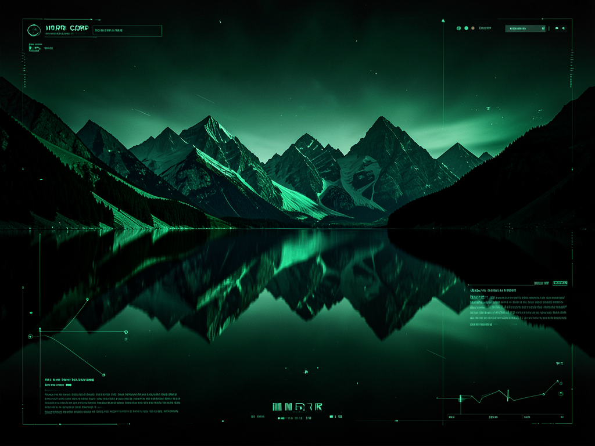

<div align="center">


# Blue Lake

**An independent editorial media lab and TV control system.**

[](LICENSE)
[]()
[]()

</div>

---

## Overview

Blue Lake is a technical control interface designed for independent media labs. It provides a unified dashboard for system telemetry, app injection, and OSINT feed management, wrapped in a high-contrast tech-noir aesthetic.

## Features

| Feature | Description |
| :--- | :--- |
| **System Console** | Real-time AI-assisted command injection and system telemetry. |
| **App Injector** | Deploy and manage third-party packages (Kodi, IPTV) on target units. |
| **Media Vault** | Archive and stream independent editorial assets with range support. |
| **Feed Nodes** | Monitor and acquire synchronized OSINT data streams. |
| **Shield Protocol** | One-click privacy masking for network telemetry. |

## Installation

### Prerequisites

- [Node.js](https://nodejs.org/) (v18+)
- [npm](https://www.npmjs.com/)

### Build from Source

1. Clone the repository:
   ```bash
   git clone https://github.com/ghostintheprompt/blue-lake.git
   cd blue-lake
   ```

2. Install dependencies:
   ```bash
   npm install
   ```

3. Configure environment:
   ```bash
   cp .env.example .env
   ```
   Set your `GEMINI_API_KEY` in the newly created `.env` file.

4. Launch the lab:
   ```bash
   npm run dev
   ```

## Usage

1. **Initialize Core**: Launch the server and navigate to `http://localhost:3000`.
2. **Synchronize AI**: Use the System Console to establish a baseline and inject initial directives.
3. **Deploy Protocols**: Use the App Injector to push necessary packages to your hardware units.
4. **Monitor Feeds**: Switch to IPTV Nodes to acquire live data streams.

## Privacy Statement

Blue Lake is **local-only**. All telemetry, logs, and system states are stored and processed on your local machine. There is **no telemetry**, no remote tracking, and no external data collection.

---

**Built by MDRN Corp — [mdrn.app](https://mdrn.app)**
*Inspired by the independent editorial directives at [ghostintheprompt.com](https://ghostintheprompt.com)*
