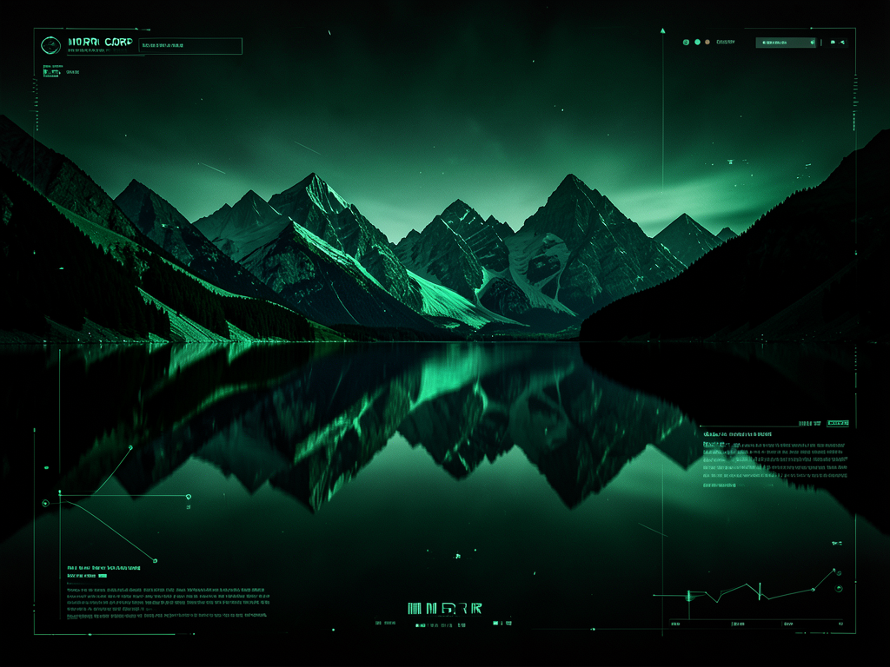

<div align="center">


# Blue Lake Studio

**Local Fire TV monitor control for photography and video rooms.**

[](LICENSE)
[]()
[]()

</div>

---

## What It Is

Blue Lake Studio is a local dashboard for photographers, videographers, and
small studio rooms using Fire TVs as large client/reference monitors.

It is built around a practical two-display workflow:

| Display | Studio Role |
|---|---|
| **TV A** | Capture One client proofing, selects, large room viewer |
| **TV B** | DaVinci Resolve playback/reference checks, reels, review pages |

Blue Lake does not replace a calibrated reference monitor. It handles the room:
wake displays, return Home, mute volume, launch receiver apps or review URLs,
and keep a clean action log so the setup is repeatable.

## Why It Exists

When you are tethering in Capture One or reviewing in DaVinci Resolve, the
last thing you want is to hunt through two remotes, menus, inputs, and volume
states. Blue Lake gives you one local control surface for the monitors in the
room.

The stance is simple:

- color-critical work stays on calibrated direct output;
- Fire TVs are excellent for client visibility, comfort, and room review;
- hardware control should be local, explicit, and dry-run until armed.

## Features

| Feature | Description |
|---|---|
| **Two-TV Dashboard** | Configure two Fire TVs by name, role, IP, and ADB port. |
| **Dry-Run ADB** | Default mode logs the exact ADB commands without touching hardware. |
| **Armed Local ADB** | Optional real ADB control for devices you own on your private studio LAN. |
| **Studio Modes** | Capture One, DaVinci, Client Review, and Mirror Check presets. |
| **App Launcher** | Launch configured Fire TV receiver apps or review URLs. |
| **Local Media Shelf** | Drop media into `public/media` and stream it locally with range support. |
| **Action Log** | See recent display commands and whether they were dry-run or armed. |

## Install

```bash
npm install
cp .env.example .env
npm run dev
```

Open:

```text
http://localhost:3000
```

## Configure Fire TVs

Edit `.env`:

```bash
BLUE_LAKE_ENABLE_ADB=false
HOST=127.0.0.1

FIRE_TV_A_NAME="Client Proof TV"
FIRE_TV_A_IP=192.168.1.50
FIRE_TV_A_ROLE="Capture One viewer"

FIRE_TV_B_NAME="Reference Playback TV"
FIRE_TV_B_IP=192.168.1.51
FIRE_TV_B_ROLE="DaVinci review"
```

Keep `BLUE_LAKE_ENABLE_ADB=false` while setting up. The dashboard will show the
commands it would run. When the IPs are correct and ADB is enabled on the TVs,
set:

```bash
BLUE_LAKE_ENABLE_ADB=true
```

Then restart the server.

Keep `HOST=127.0.0.1` if you only use the dashboard on your Mac. Use
`HOST=0.0.0.0` only when another device on your studio LAN needs to open the
dashboard in a browser.

## Fire TV ADB Setup

1. Enable Developer Options on each Fire TV.
2. Enable ADB Debugging.
3. Find each device IP address in Fire TV network settings.
4. Test from your Mac:

```bash
adb connect 192.168.1.50:5555
adb devices
```

Amazon's official Fire TV ADB documentation is here:
https://developer.amazon.com/docs/fire-tv/connecting-adb-to-device.html

## Capture One Workflow

Use Capture One's dual-monitor workspace for the main photo workflow. A Fire TV
is best as a client proofing monitor or large room viewer, not the display where
you make final color calls.

Capture One dual-monitor documentation:
https://support.captureone.com/hc/en-us/articles/360004312698-Can-I-use-two-monitors-while-working-with-Capture-One

## DaVinci Resolve Workflow

For grading, prefer direct HDMI/SDI monitoring, UltraStudio, DeckLink, or a
calibrated reference monitor. Use Fire TV for room review, playback comfort,
client visibility, and quick signal checks.

Blackmagic Design support and manuals:
https://www.blackmagicdesign.com/support

## Commands

```bash
npm run dev       # local studio server
npm run lint      # TypeScript check
npm run build     # production frontend build
```

## Safety Notes

- Use real ADB control only with devices you own or administer.
- Keep this on your private studio LAN.
- Dry-run is the default for a reason.
- Fire TV display/casting paths are convenience paths, not color-critical
  reference paths.

## Built For

Small studios, home studios, tethered photography rooms, edit bays, and solo
operators who want the displays ready without breaking creative flow.

**Blue Lake Studio:** the room gets quiet, the monitors wake up, the work stays
in front of you.
